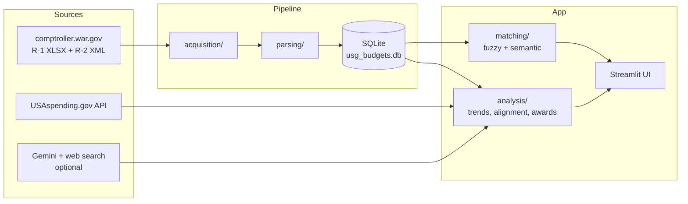

# DoD Budget Explorer

Trace a US defense program from **what was asked for**, to **what Congress
provided**, to **what the money did**, to **what officials said about it** —
in one local tool.

The explorer ingests official machine-readable budget data (R-1 exhibits,
R-2 justification books), links it to execution data (USAspending.gov), and
layers optional AI enrichment (Gemini with web grounding) for open-source
context. Everything runs locally against a SQLite database.

## What it does

| Tab | Question it answers |
|---|---|
| **Budget Trends** | How has RDT&E funding moved by component, FY1998–FY2027? Who got paid from each appropriation account? |
| **Program Finder** | Which budget program is this name / news quote / PE number? Then a full profile: funding history, official plans & reported work, contract awards, recent coverage |
| **Rhetoric vs. Budget** | Did the money follow the talk? What was requested vs. what the authorizing committees actually authorized, with the reason they printed — an exact join, no API key. Optionally overlaid with AI-characterized public emphasis and a lead-aware alignment coefficient |
| **Data Coverage** | What's ingested, what's live-queried, and the known blind spots |

Program matching is multi-stage: exact PE-number lookup, lexical matching
over titles/acronyms/project names, and semantic embeddings enriched with
official mission descriptions — with honest ambiguity flagging when several
programs share a name (joint programs usually do).

## Architecture



## Quickstart (local)

Requires Python 3.12+.

```bash
cd dod_ic_budget_analyzer
pip install torch --index-url https://download.pytorch.org/whl/cpu   # do this first
pip install -r requirements.txt
streamlit run app.py
```

**Install CPU torch first.** The default PyPI wheel is the CUDA build — several
gigabytes — and nothing here needs a GPU. Installing it first means the rest of
the requirements see torch as already satisfied. (The Dockerfile does this for
you.)

The repository ships with the processed database, so the app is useful
immediately: FY1998–FY2027 R-1 funding, R-2 mission narratives for 1,383 of
2,055 program elements across all five components, and 26,544 congressional
authorization actions from 30 NDAA committee reports covering FY2012–FY2027 in
both chambers.

The database ships **compressed** as `usg_budgets.db.gz` (27 MB) because 124 MB
raw is past GitHub's per-file limit. It expands itself the first time anything
opens it — no setup step — and the expanded file is gitignored. The first
Program Finder search downloads the sentence-transformer model (one time,
~90MB); its embeddings are prebuilt and shipped.

### Optional: AI features

Set a Gemini API key to enable ambiguity resolution, "In the News," and the
optional open-source-emphasis layer on the Rhetoric vs. Budget tab. The
congressional requested-vs-authorized figures on that tab need **no key** and
cost nothing per user:

```bash
setx GEMINI_API_KEY "your-key"     # Windows; export on Linux/macOS
```

**Keys are per-user and never live in this repository.** The app reads
`GEMINI_API_KEY` (or `GOOGLE_API_KEY`) from the environment — or, on Streamlit
Community Cloud, from the app's Secrets — and nowhere else: there is no key
file, config entry, or Docker build argument for it, and `.env` files are
gitignored as a guardrail. Don't commit credentials in any form.

### AI cost control

Every AI call is cached, metered, and capped. Results that have been fetched
before render as soon as you open the tab; only genuinely new lookups cost
anything, and a monthly ceiling stops fresh calls before a bill can run away.
Knobs live in `config.py` (`AI_MONTHLY_BUDGET_USD`, `AI_FREE_CREDITS_PER_MONTH`,
`AI_CACHE_TTL_DAYS`).

```bash
python -m analysis.ai_budget --report          # month-to-date spend by task
python -m analysis.ai_budget --prune           # drop expired cache rows
python -m analysis.ai_budget --reset-runtime   # clear ALL runtime rows (see below)
python analysis/ai_budget_eval.py              # self-check: cost math + caching rules
```

**Run `--reset-runtime` before rebuilding the shipped archive.** The database is
published in this public repository (compressed, see below), so a dev session's
cached AI results, spend ledger, and search log would otherwise be shipped — and
grounded search results must never be. The command clears those four tables and
VACUUMs the file so deleted rows are not merely unlinked. Verify with:

```bash
sqlite3 data/processed/usg_budgets.db \
  "SELECT COUNT(*) FROM ai_cache WHERE task IN ('find_open_source_hits','annual_signal');"
```

It must return 0.

Warm the cache ahead of time so the app opens with analysis already in place.
It picks targets from real search demand first, then the largest programs:

```bash
python analysis/ai_precompute.py --limit 20 --dry-run   # show the worklist
python analysis/ai_precompute.py --limit 20             # warm it
```

**Two rules the code enforces, both from the
[Gemini API terms](https://ai.google.dev/gemini-api/terms):**

- Results grounded in Google Search are stored **per user and never shared**,
  and always render with Google's Search Suggestions. Match resolution, which
  doesn't use search, is shared across everyone — so a program someone else
  already resolved costs you nothing.
- Web-grounded features **verify that the search actually ran**. This model
  will happily answer a "find recent coverage" prompt from memory, producing
  invented outlets and dates that look identical to real ones. When no search
  happened, the app shows nothing and says why rather than presenting
  recollection as sourced reporting.

## Quickstart (Streamlit Community Cloud)

The public demo runs this way with no infrastructure: deploy straight from
this repository with main file `dod_ic_budget_analyzer/app.py`. Two things are
specific to the hosted app:

- `.streamlit/config.toml` at the repository root turns the source-file
  watcher off. On a deployment the code only changes on redeploy, and with the
  watcher on Streamlit probes every imported module after each run — which
  makes transformers' lazy vision modules try to import torchvision and logs
  ~150 harmless tracebacks per scan.
- **Leave `GEMINI_API_KEY` out of a public deployment.** Every AI button would
  bill the deployer's key, and anonymous visitors all share one identity, so
  web-grounded results could not be kept per-user as the Gemini terms require.
  The app degrades cleanly: the AI panels show a one-line note and everything
  else works. For a private showing, add the key under the app's Settings →
  Secrets and **Reboot** the app — the key is read once at startup.

Community Cloud apps get roughly 1 GB of RAM; this one settles around 550–600 MB
once the matching model has loaded.

## Quickstart (Docker)

```bash
cd dod_ic_budget_analyzer
docker compose up --build
```

Then open http://localhost:8501. The compose file mounts `./data` so the
database persists outside the container, passes `GEMINI_API_KEY` through from
your environment, and caches the embedding model in a named volume.

The image is **self-contained** — it carries the compressed database and the
prebuilt embeddings, so it also runs with no checkout and no volume:

```bash
docker build -t budget-explorer . && docker run -p 8501:8501 budget-explorer
```

Under compose the mounted `./data` shadows the copies baked into the image,
which is what you want for local development.

## Updating the data

New budget cycle? Three commands:

```bash
# 1. Official R-1 spreadsheet (machine-readable, FY2012+)
python acquisition/comptroller_scraper.py --xlsx --years 2028 --exhibits rdtee

# 2. Parse and save
python parsing/xlsx_ingest.py --file data/raw/comptroller/2028/rdtee/fy2028_r1.xlsx --save

# 3. R-2 justification books (Defense-Wide XML) + ingest
python acquisition/r2_downloader.py --years 2028 --ingest
```

Then ingest the new parquet into SQLite with `storage/ingest_r1.py` (see the
notebook in `notebooks/` for the pattern). Matching quality is guarded by a
golden-set eval — run it after any matcher change:

```bash
python analysis/linker_eval.py
```

**Rebuild the shipped archive after any ingest**, or the next clone gets stale
data — the raw `.db` is gitignored and only the `.gz` is published:

```bash
python -m analysis.ai_budget --reset-runtime          # never ship AI runtime rows
gzip -9 -c data/processed/usg_budgets.db > data/processed/usg_budgets.db.gz
```

Service-branch R-2 narratives (Army, Navy, Air Force, Space Force) come from
their PDF justification books:

```bash
python acquisition/service_r2_downloader.py --service army navy --years 2028 --ingest
```

`data/raw/` is not tracked (re-downloadable PDFs/XLSX/XML); the pipeline above
rebuilds it. Pre-FY2012 years came from parsed PDFs and are already in the
shipped database.

## Data sources & honesty notes

- **R-1 exhibits** (comptroller.war.gov): official XLSX for FY2012–FY2027,
  parsed PDFs for FY1998–FY2011. Discretionary and reconciliation/mandatory
  funds are kept as separate streams.
- **R-2 justification books**: Defense-Wide via official DTIC-schema XML
  (PB2026 cycle onward); Army and Navy via the PDF books those departments
  publish; Air Force and Space Force via the Internet Archive, because their
  own host aborts the TLS handshake against every client. Parsed from the PDF
  text layer, which prints the program element verbatim in every exhibit
  header, so the join is exact rather than fuzzy. Mission descriptions,
  projects, and per-year accomplishment line items.
  **Narrative coverage is 1,383 of 2,055 program elements (67%)** — Air Force
  389, Army 346, Navy 296, Defense-Wide 282, Space Force 67, OT&E 3 — spanning
  FY2018–FY2027. Coverage is uneven by design of the sources: Army published no
  RDT&E books for FY2023, and the Internet Archive holds Air Force and Space
  Force books only through FY2024 and rate-limits retrieval to a few documents
  at a time, so that backfill converges over repeated runs.
- **NDAA authorization committee reports** (govinfo.gov): the RDT&E funding
  tables printed in HASC/SASC reports, parsed to per-program-element
  requested / committee change / authorized figures plus the committee's own
  stated reason. Key-free and, as US Government works (17 U.S.C. 105), public
  domain. **Machine-readable tables begin at FY2012** — earlier reports print
  them as GRAPHIC images, so an absent year means "not available," not "no
  action taken." A program element can hold several lines in one report (one
  per budget activity); those are summed per fiscal year, while House and
  Senate are never pooled because they score the same request separately.
  Authorization is not appropriation.
- **USAspending.gov**: live queries. Public award records carry **no
  program-element linkage**, so program-level award search is keyword
  matching — the UI labels it "leads, not a ledger." Other Transactions
  aren't a searchable instrument group; DoD awards post with a ~90-day
  delay; umbrella vehicles (PIAs, IDIQs) hide task detail in generic prime
  descriptions (a subaward search partially compensates).
- **AI enrichment**: clearly labeled as AI estimates. The Rhetoric vs.
  Budget signal is an LLM characterization grounded in web search, not a
  media-analytics count; its alignment coefficient is a Spearman rank
  correlation at 0–2-year funding leads and refuses to compute on fewer
  than 4 overlapping years. Both web-grounded features discard output the
  model produced without actually searching, so an empty panel means "nothing
  retrieved," never "here's what I vaguely recall."

## Project layout

```
dod_ic_budget_analyzer/
├── acquisition/     # downloaders: comptroller XLSX/PDF, R-2 XML, USAspending
├── parsing/         # R-1 XLSX/PDF parsers, R-2 jbook XML parser
├── storage/         # SQLAlchemy schema + ingest pipelines
├── matching/        # normalizer, fuzzy matcher, semantic matcher
├── analysis/        # trends, program linker, awards, rhetoric alignment, eval
├── data/processed/  # SQLite DB, parquet, embedding cache (tracked)
├── data/raw/        # source documents (not tracked; rebuildable)
└── app.py           # Streamlit UI
```

## Roadmap

- Service R-2 narratives (Army/Navy/AF publish PDF-only — needs extraction)
- Re-base FY2012–FY2026 funding on official XLSX end to end
- Enacted-vs-request deltas from appropriations Joint Explanatory Statements
- IC topline (NIP/MIP) tracking
- UI polish pass
