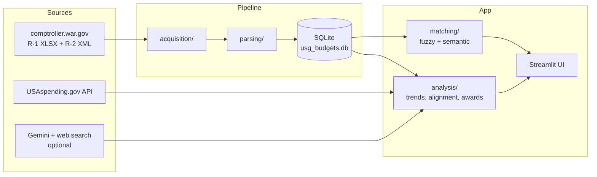

# DoD Budget Explorer

Trace a US defense program from **what was asked for**, to **what Congress
provided**, to **what the money did**, to **what officials said about it** —
in one local tool.

The explorer ingests official machine-readable budget data (R-1 exhibits,
R-2 justification books), links it to execution data (USAspending.gov), and
layers optional AI enrichment (Gemini with web grounding) for open-source
context. Everything runs locally against a SQLite database.

## What it does

| Tab | Question it answers |
|---|---|
| **Budget Trends** | How has RDT&E funding moved by component, FY1998–FY2027? Who got paid from each appropriation account? |
| **Program Finder** | Which budget program is this name / news quote / PE number? Then a full profile: funding history, official plans & reported work, contract awards, recent coverage |
| **Rhetoric vs. Budget** | Did the money follow the talk? AI-characterized public emphasis correlated against the funding trajectory, with a lead-aware alignment coefficient |
| **Data Coverage** | What's ingested, what's live-queried, and the known blind spots |

Program matching is multi-stage: exact PE-number lookup, lexical matching
over titles/acronyms/project names, and semantic embeddings enriched with
official mission descriptions — with honest ambiguity flagging when several
programs share a name (joint programs usually do).

## Architecture



## Quickstart (local)

Requires Python 3.12+.

```bash
cd dod_ic_budget_analyzer
pip install -r requirements.txt
streamlit run app.py
```

The repository ships with the processed database (FY1998–FY2027 R-1 funding,
PB2026–PB2027 Defense-Wide narratives), so the app is useful immediately.
The first Program Finder search downloads the sentence-transformer model
(one time, ~90MB).

### Optional: AI features

Set a Gemini API key to enable ambiguity resolution, "In the News," and the
Rhetoric vs. Budget tab:

```bash
setx GEMINI_API_KEY "your-key"     # Windows; export on Linux/macOS
```

## Quickstart (Docker)

```bash
cd dod_ic_budget_analyzer
docker compose up --build
```

Then open http://localhost:8501. The compose file mounts `./data` (database
persists outside the container), passes `GEMINI_API_KEY` through from your
environment, and caches the embedding model in a named volume.

## Updating the data

New budget cycle? Three commands:

```bash
# 1. Official R-1 spreadsheet (machine-readable, FY2012+)
python acquisition/comptroller_scraper.py --xlsx --years 2028 --exhibits rdtee

# 2. Parse and save
python parsing/xlsx_ingest.py --file data/raw/comptroller/2028/rdtee/fy2028_r1.xlsx --save

# 3. R-2 justification books (Defense-Wide XML) + ingest
python acquisition/r2_downloader.py --years 2028 --ingest
```

Then ingest the new parquet into SQLite with `storage/ingest_r1.py` (see the
notebook in `notebooks/` for the pattern). Matching quality is guarded by a
golden-set eval — run it after any matcher change:

```bash
python analysis/linker_eval.py
```

`data/raw/` is not tracked (≈55MB of re-downloadable PDFs/XLSX/XML); the
pipeline above rebuilds it. Pre-FY2012 years came from parsed PDFs and are
already in the shipped database.

## Data sources & honesty notes

- **R-1 exhibits** (comptroller.war.gov): official XLSX for FY2012–FY2027,
  parsed PDFs for FY1998–FY2011. Discretionary and reconciliation/mandatory
  funds are kept as separate streams.
- **R-2 justification books**: official DTIC-schema XML, published from the
  PB2026 cycle onward, Defense-Wide components only (the services publish
  PDF-only). Mission descriptions, projects, and per-year accomplishment
  line items with funding.
- **USAspending.gov**: live queries. Public award records carry **no
  program-element linkage**, so program-level award search is keyword
  matching — the UI labels it "leads, not a ledger." Other Transactions
  aren't a searchable instrument group; DoD awards post with a ~90-day
  delay; umbrella vehicles (PIAs, IDIQs) hide task detail in generic prime
  descriptions (a subaward search partially compensates).
- **AI enrichment**: clearly labeled as AI estimates. The Rhetoric vs.
  Budget signal is an LLM characterization grounded in web search, not a
  media-analytics count; its alignment coefficient is a Spearman rank
  correlation at 0–2-year funding leads and refuses to compute on fewer
  than 4 overlapping years.

## Project layout

```
dod_ic_budget_analyzer/
├── acquisition/     # downloaders: comptroller XLSX/PDF, R-2 XML, USAspending
├── parsing/         # R-1 XLSX/PDF parsers, R-2 jbook XML parser
├── storage/         # SQLAlchemy schema + ingest pipelines
├── matching/        # normalizer, fuzzy matcher, semantic matcher
├── analysis/        # trends, program linker, awards, rhetoric alignment, eval
├── data/processed/  # SQLite DB, parquet, embedding cache (tracked)
├── data/raw/        # source documents (not tracked; rebuildable)
└── app.py           # Streamlit UI
```

## Roadmap

- Service R-2 narratives (Army/Navy/AF publish PDF-only — needs extraction)
- Re-base FY2012–FY2026 funding on official XLSX end to end
- Enacted-vs-request deltas from appropriations Joint Explanatory Statements
- IC topline (NIP/MIP) tracking
- UI polish pass
